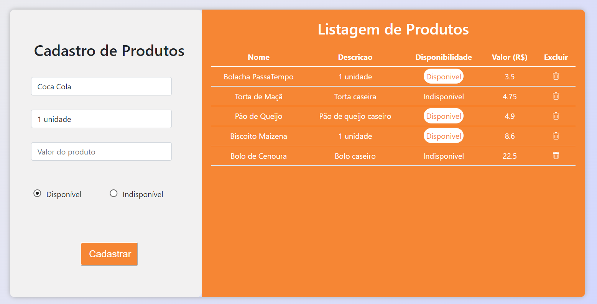

# Cadastro e listagem de produto: Processo seletivo OAK

Projeto construído para o processo seletivo da empresa OAK Tecnologia com o desenvolvimento de uma página web para o cadastro e listagem de produtos.

[Clique aqui para acessar a página](https://ericlamounier.github.io/Cadastro-de-Produtos/)

## Como executar
- Executar o comando `npm install`
- Inicializar  json-server com o seguinte comando `json-server --watch db.json`
- Acesse o `index.html`
- Cadastre um produto

## Tecnologias

- HTML5
- CSS3
- JavaScript

## Contato
eric.botelho@ufv.br

eric_lamounier@outlook.com